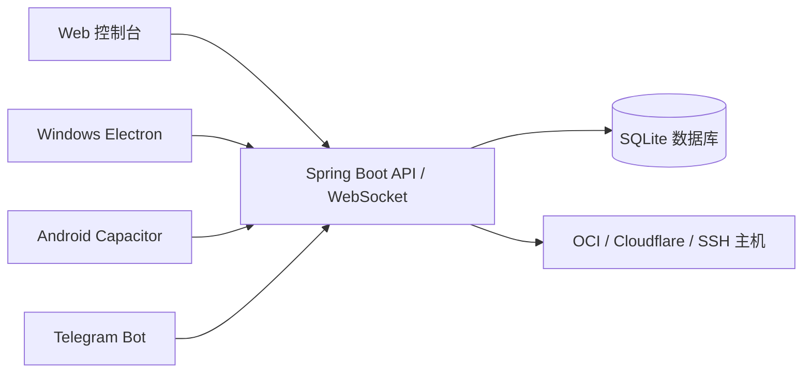

# Wang-Detective 2

[](https://github.com/tony-wang1990/Wang-Detective-2/actions/workflows/docker-image.yml)
[](LICENSE)

Wang-Detective 2 是面向 Oracle Cloud Infrastructure（OCI）的统一运维平台。一个 VPS 后端同时服务 Web 控制台、Windows 客户端、Android APP 和 Telegram Bot，所有业务数据、权限和操作审计都由同一套 Spring Boot API 管理。

项目覆盖 OCI 配置、实例与任务、网络与安全规则、引导卷、Cloudflare、Web SSH/SFTP、风险诊断、备份恢复、救援操作和 Telegram 运维菜单。Windows 与 Android 复用同一套 Vue 界面，不维护独立业务数据库，因此不需要额外的数据同步服务。

## 架构



- Web、Windows、Android 使用相同的 Vue 路由、API 和权限模型。
- 客户端只保存 VPS 地址和当前登录 Token，业务数据全部保存在 VPS。
- Spring 中注册的 155 个 Telegram 回调处理器已经接入“全部功能”客户端网关。
- VNC URL、加密备份密码、恢复 ZIP 上传和账号导入等会话式操作可以直接在客户端完成。
- Android 通过 Capacitor Filesystem、Share 和 Browser 处理文件保存、分享及外部链接。

## 主要功能

| 模块 | 功能 |
| --- | --- |
| 控制概览 | OCI 数量、实例状态、任务、风险、地图、系统诊断与运行指标 |
| OCI 配置 | Config 与私钥导入、连通性校验、租户、区域、实例和资源详情 |
| 实例管理 | 开机、关机、重启、终止、改名、Shape、CPU/内存、IPv6、换 IP、500M、VNC |
| 任务管理 | 创建任务、分页与筛选、详情、停止、批量停止和状态追踪 |
| 网络与安全 | VCN、安全列表、端口风险、引导卷、VNIC、Cloudflare 与 DNS |
| 运维终端 | SSH 主机库、Web SSH、SFTP、命令模板、会话重连与文件传输 |
| 备份恢复 | 普通/加密备份、本地归档、Object Storage、定时备份与 ZIP 恢复 |
| 救援中心 | SSH 轻量自救、OCI 拆卷救援、自动救援、netboot.xyz UEFI 预检 |
| 安全审计 | JWT、MFA、登录防爆破、IP 黑名单、操作审计与 CSV 导出 |
| 全部功能 | 复用 155 个 Telegram 处理器，支持菜单、分页、确认、附件和会话输入 |
| 多端客户端 | Web、Windows、Android 共用 VPS 数据，控制台提供安装包下载与 SHA256 |

## 部署要求

- Linux VPS：Debian 11+、Ubuntu 20.04+、Oracle Linux 8+ 或兼容发行版
- 最低建议：1 核 CPU、1 GB 内存、10 GB 可用磁盘
- Docker Engine 与 Docker Compose v2
- 对外开放 `9527/tcp`，或使用 Nginx/Caddy 反向代理到 HTTPS 域名
- 管理 OCI 时需要 OCI API Config 和对应私钥

生产环境强烈建议使用 HTTPS。Windows 和 Android 客户端首次登录时填写的是 VPS 根地址，例如 `https://detective.example.com`，不要附加 `/api`。

## 一键部署

以 root 用户登录 VPS，先设置管理员账号和强密码，再执行安装脚本：

```bash
export ADMIN_USERNAME=admin
export ADMIN_PASSWORD='替换为至少16位强密码'
export OPS_SSH_SECRET_KEY='替换为另一段随机长密钥'

bash <(wget -qO- https://raw.githubusercontent.com/tony-wang1990/Wang-Detective-2/main/scripts/install.sh)
```

安装脚本会：

1. 安装或检查 Docker 与 Compose。
2. 创建 `/app/king-detective` 及持久化目录。
3. 下载 Compose、应用配置和维护脚本。
4. 生成权限为 `600` 的 `.env`。
5. 拉取 GHCR 镜像并等待健康检查通过。

部署完成后访问：

```text
http://VPS_IP:9527
```

健康检查：

```bash
curl -fsS http://127.0.0.1:9527/actuator/health
```

如果 GHCR 包尚未设为公开，需要先登录：

```bash
echo '你的 GitHub PAT' | docker login ghcr.io -u tony-wang1990 --password-stdin
```

## 手动部署

```bash
git clone https://github.com/tony-wang1990/Wang-Detective-2.git
cd Wang-Detective-2
cp .env.example .env
chmod 600 .env
```

编辑 `.env`，至少修改：

```env
ADMIN_USERNAME=admin
ADMIN_PASSWORD=替换为强密码
OPS_SSH_SECRET_KEY=替换为另一段随机长密钥
KING_DETECTIVE_GITHUB_REPOSITORY=tony-wang1990/Wang-Detective-2
KING_DETECTIVE_IMAGE=ghcr.io/tony-wang1990/wang-detective-2:main
```

然后启动：

```bash
docker compose pull
docker compose up -d
docker compose ps
```

从源码构建本地镜像：

```bash
docker build -t wang-detective-local:latest .
sed -i 's|^KING_DETECTIVE_IMAGE=.*|KING_DETECTIVE_IMAGE=wang-detective-local:latest|' .env
docker compose up -d
```

## HTTPS 反向代理

Nginx 示例：

```nginx
server {
    listen 443 ssl http2;
    server_name detective.example.com;

    client_max_body_size 50m;

    location / {
        proxy_pass http://127.0.0.1:9527;
        proxy_http_version 1.1;
        proxy_set_header Host $host;
        proxy_set_header X-Real-IP $remote_addr;
        proxy_set_header X-Forwarded-For $proxy_add_x_forwarded_for;
        proxy_set_header X-Forwarded-Proto $scheme;
        proxy_set_header Upgrade $http_upgrade;
        proxy_set_header Connection "upgrade";
        proxy_read_timeout 3600s;
    }
}
```

证书可以使用 Certbot、Caddy 或现有反向代理管理器签发。客户端、WebSocket、下载和 API 必须通过同一个域名访问。

## 环境变量

完整示例见 [.env.example](.env.example)。常用配置如下：

| 变量 | 默认值 | 说明 |
| --- | --- | --- |
| `ADMIN_USERNAME` | `admin` | Web 与客户端管理员账号 |
| `ADMIN_PASSWORD` | `admin123456` | 管理员密码，生产环境必须修改 |
| `OPS_SSH_SECRET_KEY` | 管理员密码 | SSH 凭据加密密钥，建议单独设置 |
| `SERVER_PORT` | `9527` | 后端监听端口 |
| `CORS_ALLOWED_ORIGINS` | `*` | 允许的前端来源，生产环境建议指定域名 |
| `TELEGRAM_BOT_TOKEN` | 空 | Telegram Bot Token，留空则不启动 Bot |
| `TELEGRAM_BOT_CHAT_ID` | 空 | 允许接收通知和操作 Bot 的 Chat ID |
| `KING_DETECTIVE_IMAGE` | `ghcr.io/tony-wang1990/wang-detective-2:main` | Docker 镜像 |
| `KING_DETECTIVE_CLIENT_VERSION` | `0.1.1` | 客户端下载中心显示版本 |
| `CLIENT_DOWNLOAD_DIR` | `/app/king-detective/deploy/downloads` | Windows/APK 安装包目录 |
| `AUTO_BACKUP_ENABLED` | `false` | 是否启用自动备份 |
| `AUTO_BACKUP_CRON` | `0 0 3 * * ?` | 自动备份 Cron |
| `INSTANCE_MONITOR_ENABLED` | `false` | 是否启用实例监控 |
| `SFTP_UPLOAD_MAX_FILE_SIZE` | `50MB` | 单文件上传上限 |

修改 `.env` 后重建容器：

```bash
cd /app/king-detective
docker compose up -d --force-recreate king-detective watcher
```

## 首次使用

### 1. 登录并修改凭据

使用 `.env` 中的 `ADMIN_USERNAME` 和 `ADMIN_PASSWORD` 登录。进入“系统配置”后可以修改管理员账号、密码、MFA、Telegram、Google 登录和通知设置。修改管理员凭据后旧 Token 会立即失效，需要重新登录。

### 2. 添加 OCI 配置

在 OCI Console 中为用户生成 API Key，保存私钥，并取得类似以下内容：

```ini
[DEFAULT]
user=ocid1.user.oc1..example
fingerprint=aa:bb:cc:dd:ee
tenancy=ocid1.tenancy.oc1..example
region=ap-singapore-1
```

进入“配置列表”并点击“新增配置”：

1. 填写便于识别的配置名称。
2. 上传与 fingerprint 对应的私钥文件。
3. 粘贴 OCI Config 内容。
4. 点击“提交并校验”。

私钥保存在 VPS 的 `keys/` 持久化目录，不会下发到 Windows 或 Android 客户端。

### 3. 使用业务模块

- “配置列表”查看实时 OCI 资源并执行实例、网络和引导卷操作。
- “任务列表”创建或停止自动任务。
- “资源工具”管理 Cloudflare/DNS、IP 数据、租户安全和流量查询。
- “全部功能”访问原 Telegram 菜单对应的完整处理器集合。
- “运维终端”连接受管 SSH 主机并使用 SFTP。
- “备份归档”先创建备份，再进行恢复或 Object Storage 操作。

终止实例、删除资源、恢复数据库等操作不可逆。执行前应创建备份，并优先使用专用测试租户验收。

## Windows 客户端

### 使用

1. 从 Web 控制台“客户端下载”获取安装器，或使用自行构建的 EXE。
2. 首次启动填写 VPS 根地址，例如 `https://detective.example.com`。
3. 使用与 Web 相同的管理员账号登录。
4. Windows、Web、Android 的业务修改会立即写入同一 VPS。

未配置代码签名证书时，Windows 可能显示未知发布者提示。正式分发应配置 Authenticode 证书。

### 构建

```powershell
npm install --prefix frontend
npm install --prefix apps/desktop
npm --prefix apps/desktop run dist:win
```

输出目录：

```text
apps/desktop/release/Wang-Detective-Setup-0.1.1.exe
```

发布到 VPS 下载目录：

```bash
node scripts/publish-client-package.mjs windows apps/desktop/release/Wang-Detective-Setup-0.1.1.exe
```

## Android APP

### 使用

1. 从“客户端下载”获取 APK 并允许浏览器安装未知来源应用。
2. 首次启动填写 HTTPS VPS 根地址。
3. 使用与 Web 相同的管理员账号登录。
4. 导出、备份和 SFTP 文件会通过 Android 系统分享/保存面板处理。

当前工程最低 SDK 为 22，目标/编译 SDK 为 34。正式分发前需要配置 release keystore；调试签名只适合测试和内部安装。

### 构建

需要 Node.js 20+、JDK 17、Android SDK 34 和 Android Studio：

```bash
npm install --prefix frontend
npm install --prefix apps/android
npm --prefix apps/android run build:apk
```

输出目录：

```text
apps/android/android/app/build/outputs/apk/debug/app-debug.apk
```

发布到 VPS 下载目录：

```bash
node scripts/publish-client-package.mjs android apps/android/android/app/build/outputs/apk/debug/app-debug.apk
```

### 客户端安装包同步

GitHub 最新 Release 提供固定名称的 Windows 安装包、Android APK 和 SHA256 校验文件。一键安装和后续更新会自动把它们同步到 `deploy/downloads`。手动同步：

```bash
cd /app/king-detective
bash scripts/sync-client-packages.sh
```

同步脚本会先下载 `.sha256` 文件，校验通过后再原子替换本地安装包。即使 VPS 本地文件尚未同步，下载中心也会回退到 GitHub Release 地址，不会禁用下载按钮。

## Telegram Bot

Telegram 是可选入口。设置以下变量后重启服务：

```env
TELEGRAM_BOT_TOKEN=123456:example
TELEGRAM_BOT_CHAT_ID=你的ChatID
TELEGRAM_BOT_USERNAME=king_detective_bot
```

Bot 与三端客户端调用同一套业务服务。Telegram 的按钮、分页和确认处理器同时可在“全部功能”页面使用。

## 数据、备份与恢复

VPS 持久化目录：

```text
/app/king-detective/data       SQLite 数据库
/app/king-detective/keys       OCI 私钥
/app/king-detective/backups    本地备份
/app/king-detective/deploy     客户端安装包
/app/king-detective/logs       日志
/app/king-detective/runtime    运行时状态
```

维护入口：

```bash
cd /app/king-detective
bash scripts/maintenance.sh menu
```

常用命令：

```bash
bash scripts/maintenance.sh status
bash scripts/maintenance.sh health
bash scripts/maintenance.sh logs 200
bash scripts/maintenance.sh backup
bash scripts/maintenance.sh verify-backup /path/to/backup.tar.gz
bash scripts/maintenance.sh restore /path/to/backup.tar.gz
bash scripts/maintenance.sh update
bash scripts/maintenance.sh sync-clients
bash scripts/maintenance.sh smoke
bash scripts/maintenance.sh support
```

恢复会覆盖当前数据库与密钥。建议先使用 `verify-backup` 校验，并在恢复前额外复制当前 `data/` 和 `keys/`。

## 本地开发

### 后端

需要 JDK 21 与 Maven 3.9+：

```bash
mvn test
mvn spring-boot:run
```

后端默认监听 `http://127.0.0.1:9527`。

### Web 前端

```bash
npm install --prefix frontend
npm --prefix frontend run dev
```

Vite 默认使用 `http://127.0.0.1:5173`，并将 `/api` 与 `/actuator` 代理到本地后端。

生产构建：

```bash
npm --prefix frontend run build
mvn -DskipTests package
```

生成的 Spring Boot JAR 位于 `target/`，并包含最新 Vue 静态资源。

## 发布前验证

```bash
mvn test
npm --prefix frontend run build
node scripts/acceptance-check.mjs
node scripts/verify-ui-api-mapping.mjs
node scripts/verify-telegram-callbacks.mjs
```

当前自动验收基线：

- Java 21 / Maven：15 项测试通过。
- 后端 Controller：127 个端点。
- 前端 API：100 个调用，均有匹配后端映射。
- Telegram：114 个按钮 callback、155 个处理器模式，映射检查通过。
- Windows Electron 与 Android Gradle 构建通过。

自动测试不能安全替代真实 OCI 验收。终止实例、删除 VCN/安全规则/引导卷、拆卷救援和完整恢复等破坏性动作，应在专用资源上逐项验证。

## 排障

查看容器与日志：

```bash
cd /app/king-detective
docker compose ps
docker logs --tail 200 king-detective
docker logs --tail 200 king-detective-watcher
```

客户端无法连接时检查：

1. 地址是否为 VPS 根地址，且没有附加 `/api`。
2. 浏览器能否打开 `/actuator/health`。
3. HTTPS 证书是否受系统信任。
4. 反向代理是否转发 `Upgrade` 和 `Connection` 请求头。
5. `CORS_ALLOWED_ORIGINS` 是否允许当前来源。

生成脱敏支持包：

```bash
bash /app/king-detective/scripts/support-bundle.sh
```

## 文档

- [Windows、Android 与 VPS 统一客户端](docs/CLIENT_APPS.md)
- [部署说明](docs/DEPLOYMENT.md)
- [部署冒烟验收](docs/DEPLOYMENT_SMOKE_TEST.md)
- [运维脚本](docs/OPERATIONS_SCRIPTS.md)
- [验收矩阵](docs/ACCEPTANCE_MATRIX.md)
- [代码审计报告](docs/CODE_AUDIT_REPORT.md)
- [安全策略](SECURITY.md)

## 安全提示

- 不要提交 `.env`、OCI 私钥、数据库、备份、日志或正式签名文件。
- 首次部署后立即修改默认管理员密码并启用 MFA。
- 限制 `CORS_ALLOWED_ORIGINS`，并通过 HTTPS 暴露服务。
- 对 SSH、恢复、删除和终止类操作保留操作审计。
- 定期备份 `data/`、`keys/` 和 `.env`，并实际演练恢复流程。

## License

本项目使用 [Apache License 2.0](LICENSE)。
